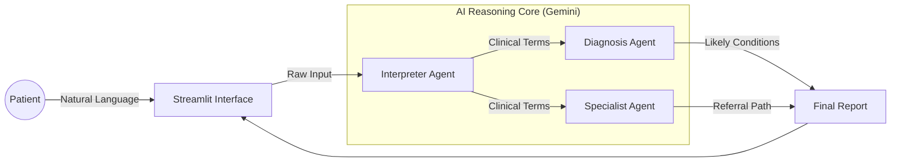

# AI Healthcare Assistant & Symptom Triage System

> **Impact Statement:** This clinical decision support tool reduces patient uncertainty by translating natural language symptoms into structured medical triage recommendations. It leverages Large Language Models (LLMs) to bridge the gap between patient complaints and specialist referrals, aiming to optimize healthcare navigation.

## Overview

Developed by a Data Engineer with **10 years of clinical research experience**, this application demonstrates how Generative AI can be safely architected to assist in preliminary healthcare triage.

Unlike generic chatbots, this system follows a structured clinical reasoning workflow:
1.  **Symptom Interpretation**: Translates layperson descriptions (e.g., "my tummy hurts") into clinical terminology.
2.  **Differential Analysis**: Suggests potential conditions based on presented symptoms.
3.  **Specialist Referral**: Routes the patient to the correct medical domain (e.g., Gastroenterology vs. Emergency Medicine).


## System Architecture

The application uses a modular prompt engineering approach where clinical logic is decoupled from the application code.



## Features

-   **Natural Language Processing**: Accepts unstructured symptom descriptions in plain English.
-   **Structured Triage**: Separates the "what" (symptoms) from the "why" (conditions) and "who" (specialist).
-   **Modular Prompt Management**: Uses `prompts.txt` to version-control clinical prompt logic independently of Python code.

## Tech Stack

-   **Frontend**: Streamlit
-   **LLM Backend**: Google Gemini API
-   **Language**: Python 3.10+
-   **Configuration**: Dotenv for secure API key management

## Setup & Installation

1.  **Clone the repository**
    ```bash
    git clone https://github.com/yinli113/ai-healthcare-assistant.git
    cd ai-healthcare-assistant
    ```

2.  **Create a virtual environment**
    ```bash
    python -m venv venv
    source venv/bin/activate  # On Windows: venv\Scripts\activate
    ```

3.  **Install dependencies**
    ```bash
    pip install -r requirements.txt
    ```

4.  **Configure Environment**
    Create a `.env` file in the root directory:
    ```ini
    GOOGLE_API_KEY=your_gemini_api_key_here
    PROMPT_FILE_PATH=prompts.txt
    ```

5.  **Run the Application**
    ```bash
    streamlit run main.py
    ```

## Future Roadmap

-   **EHR Integration**: Structured export (FHIR format) for integration with Electronic Health Records.
-   **Safety Guardrails**: Implementation of NeMo Guardrails to prevent non-medical advice hallucinations.
-   **Multimodal Input**: Support for uploading images (e.g., skin rashes) for visual analysis.

---

**Disclaimer**: *This tool is for demonstration and educational purposes only. It is not a certified medical device and should not replace professional medical advice.*
